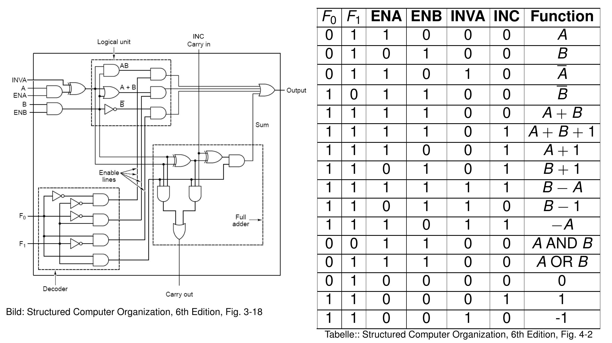

# Mic-1

## Registers

Registers sind im wesentlichen 32-Bit/4-byte Speicher (Ausnahme: `MBR` nur 1 Byte/8 Bit breit).

### Namen

Registers mit Specherzugriff:

- `MDR`: Memory Data Register
- `MAR`: Memory Address Register
- `PC`: Program Counter
- `MBR`: Memory Buffer Register

----

- `SP`: Stack Pointer
- `LV`: Local Variable
- `CPP`: Constant Pool Pointer
- `TOS`: Top of Stack
- `OPC`: Old Program Counter
- `H`: Help Register
  
### Descriptionen

#### `MDR`: Memory Data Register

Beinhaltet das Wert des Speicherwortes, das gelesen oder geschrieben werden soll.

#### `MAR`: Memory Address Register

Beinhaltet die Adresse des Speicherwortes, das gelesen oder geschrieben werden soll.

#### `PC`: Program Counter

Beinhaltet die Adresse des nächsten Befehls (in der Method Area). Wird nach jedem Befehl inkrementiert.

#### `MBR`: Memory Buffer Register

Beinhaltet das Wert des Speicherwortes, die in Adresse `PC` steht. Also was als nächstes ausgeführt werden soll.

#### `SP`: Stack Pointer

Beinhaltet die Adresse des obersten Elements auf dem Stack.

#### `LV`: Local Variable

Beinhaltet die Adresse der unteren Rand des aktuellen Stackframes (`OBJREF`).

#### `CPP`: Constant Pool Pointer

Adresse des ersten Elements im Constant Pool. Es ändert sich nicht während der Laufzeit.

#### `TOS`: Top of Stack

Wert des obersten Wort auf dem Stack.

#### `OPC`: Old Program Counter

#### `H`: Help Register

Das verwenden wir, wenn wir zwei Operanten brauchen. Was in H liegt, liegt auch an A an (ALU Eingang).

## ALU

Wir haben in der `ALU` 32 von diese Einheiten in Verkettung.

- `N`: Negative Flag (Das Ergebnis der letzten Operation eine 1 im MSB hat)
- `Z`: Zero Flag (Das Ergebnis der letzten Operation eine 0 ist)

## Hauptspeicher

Wir haben im Hauptspeicher drei verschiedene Speicherbereiche:

- `Constant Pool`
- `Stack Frame`
- `Method Area`

Wir interagieren (rd, write, fetch) mit dem Hauptspeicher über die `MAR` und `MDR` [Registers](#namen).

## Zyklus

genauer [weiter unten](#ablauf-eines-zyklus)

### Speichern

- Lade in `MAR` die Addresse des Wortes, das wir speichern wollen. (1. Zyklus)
- Lade in `MDR` das Wert des Wortes, das wir speichern wollen. (2. Zyklus)
- Speicher signalisieren (Ende des 2. Zyklus)
- Daten sind am Ende des 3. Zyklus im Speicher. `MDR` und `MAR` dürfen während des 3. Zyklus wieder verwendet werden.

### Laden

- Lade in `MAR` die Addresse des Wortes, das wir laden wollen. Signalisiere, dass geladen werden soll (1. Zyklus)
- Ergebnis ist am Ende des 2. Zyklus in `MDR`. Ursprüngliche Inhalt des `MDR` darf im 2. Zyklus noch verwendet werden aber nicht vom C-Bus geschrieben werden (sonst Kollision).
- Ab dem 3. Zyklus darf der neuen Inhalt des `MDR` verwendet werden.

### Bytecode Zugriff

Wir nutzen hier die `PC` und `MBR` [Registers](#namen), um den Bytecode byteweise zu lesen, mit einem `Fetch` Signal.

## Mikroinstruktionen

Anhand 36-Bit Mikroinstruktionen wird die [ALU](#alu) und die [Registers](#registers) gesteuert.

### Mikroinstruktionen Format

#### Addr (9 Bit)

Beinhaltet `NEXT_ADDRESS` (Adresse der nächsten Mikroinstruktion), je nachdem was in [`JAM`](#jam-3-bit) steht.

#### JAM (3 Bit)

- `JMPC`: Jump on [``PC``](#pc-program-counter ) 
Bytecode byte wird in `MPC` geladen. z.B. `0x60` für `IADD`.
- `JAMN`: Jump if Negative 
  ``MPC[8] = NEXT_ADDRESS[8] OR N``
- `JAMZ`: Jump if Zero 
`MPC[8] = NEXT_ADDRESS[8] OR Z`

Es gilt insgesamt: `MPC[8] = (JAMZ AND Z) OR (JAMN AND N) OR NEXT_ADDRESS[8]`

#### ALU (8 Bit)

- `SLL8`: Shift Left Logical 8
- `SRA1`: Shift Right Arithmetic 1
- `F0` - `INC`: [ALU](#alu) Input

#### C-Bus (9 Bit)

Welche Register vom C-Bus geschrieben werden sollen, je nachdem welche Bits auf 1 gesetzt sind.

#### Mem (3 Bit)

#### B (4 Bit)

Was auf den B-Bus gelegt werden soll. Dafür ist folgende Kodierung vorgesehen:

## Kontrollpfad

## Ablauf eines Zyklus

### &Delta;w

Wir nehmen die 9-Bit Addresse die in `MPC` steht und laden die Mikroinstruktion aus `control store`, die in dieser Adresse steht, in `MIR`.

### &Delta;x

- Wert von `B` in `MIR` wird dekodiert und auf den B-Bus gelegt.
- Es wird das Wert vom jeweiligen Register am [``ALU``](#alu) Eingang ``B`` gelegt.
- Wert von `H` wird am [``ALU``](#alu) Eingang ``A`` gelegt.

### &Delta;y

- `ALU` rechnet gemäß [Mikroinstruktion](#alu-8-bit) und leitet das Ergebnis an den Shifter weiter.
- `Shifter` modifiziert das Ergebnis.
  
### &Delta;z

- Ergebnis vom Shifter auf den ``C-Bus`` stabilisiert sich.

### Steigende Flanke

- Register werden vom ``C-Bus`` neugeladen.
